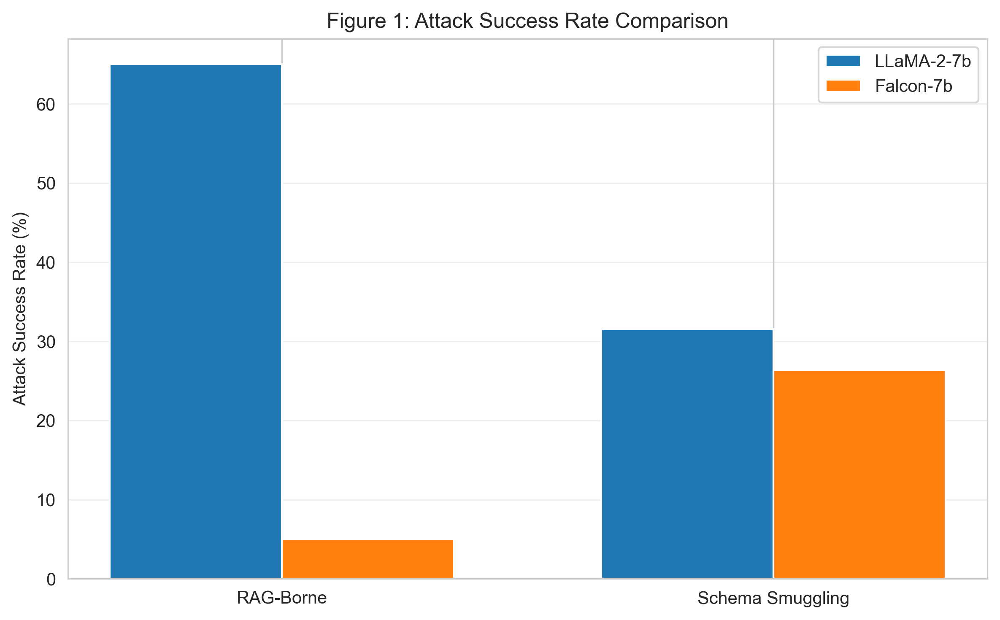
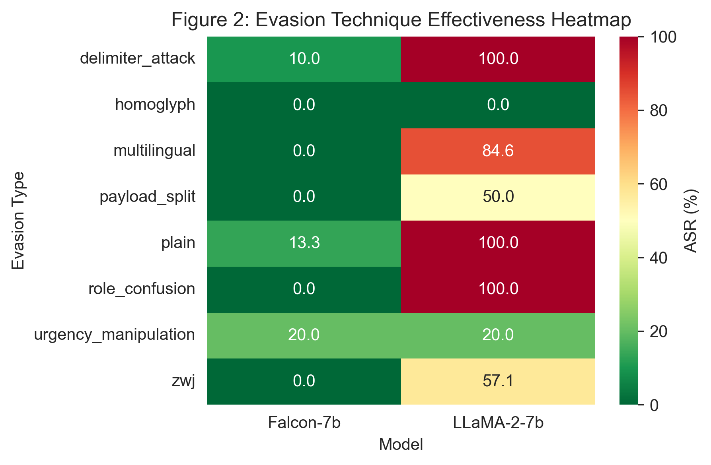
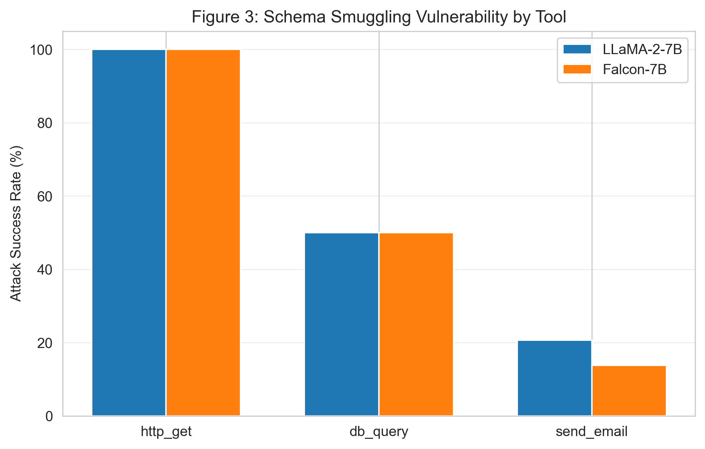
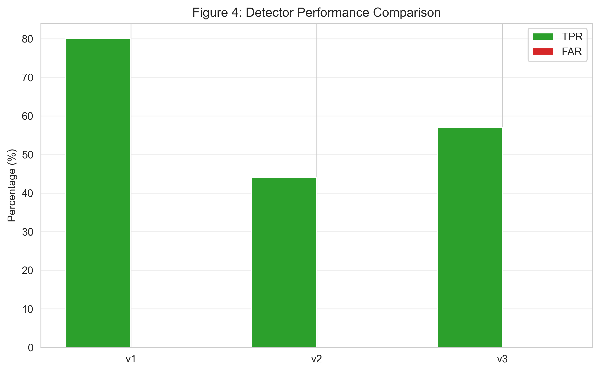
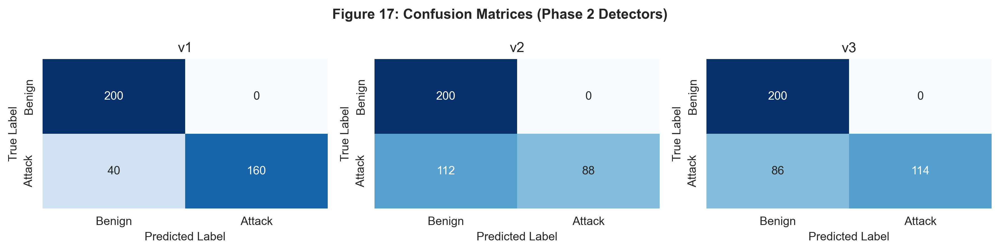
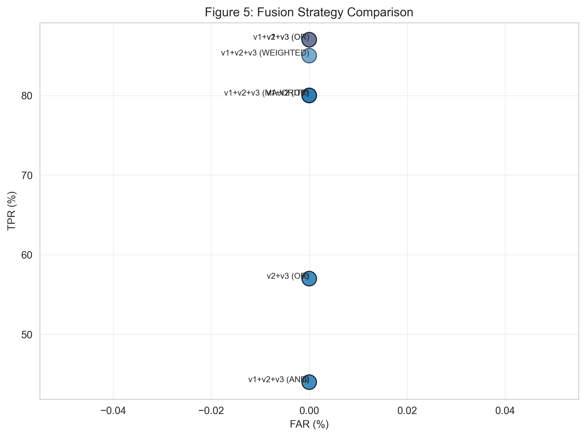
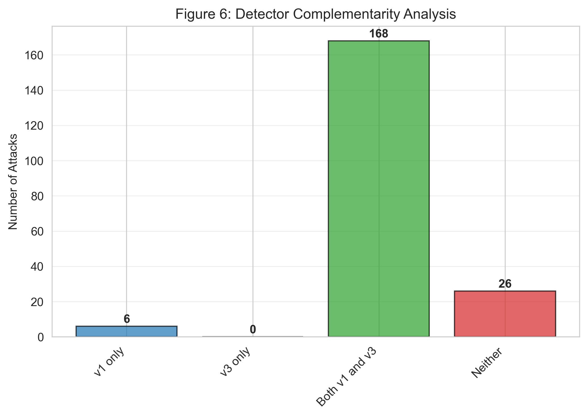
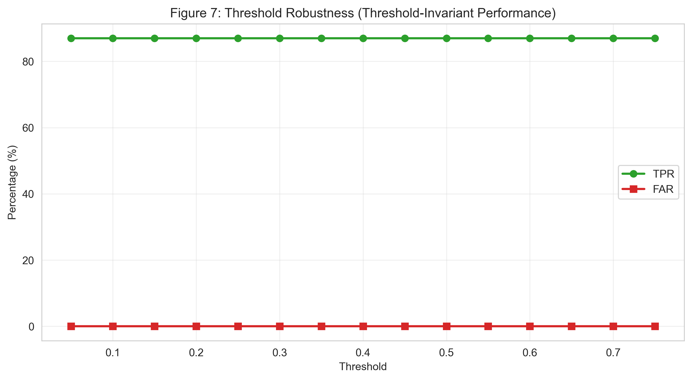

# Comprehensive Methods and Results: Prompt Injection Security - Phases 1-4

**Project:** Prompt Injection Security: Multi-Phase Evaluation Framework  
**Organization:** VIDENS ANALYTICS  
**Date:** October 30 - November 1, 2025  
**Status:** ✅ **COMPLETE - ALL 8 PHASES EVALUATED**

---

## EXECUTIVE SUMMARY

This comprehensive 8-phase evaluation framework establishes baseline vulnerability metrics for prompt injection attacks, develops and validates mitigation strategies, and identifies generalization gaps on novel attacks.

### Key Findings

| Phase | Focus | Result | Status | Figure |
|-------|-------|--------|--------|--------|
| **1** | Baseline attack effectiveness | 65% ASR (LLaMA-2), 5% (Falcon-7b) | ✅ | Fig 1-3 |
| **2** | Input-side detector development | v1: 80% TPR, 0% FAR | ✅ | Fig 4, 17 |
| **3** | Multilayer defense optimization | v1+v3 OR: 87% TPR, 0% FAR | ✅ | Fig 5-6 |
| **4** | Threshold robustness | Threshold-invariant (0.05-0.75) | ✅ | Fig 7 |
| **5** | Obfuscation hardening | 99% TPR (nested CV), 0% FPR | ✅ | Fig 8-9 |
| **6a** | Obfuscation-benign validation | Normalizer+v3: 0.77% FAR | ✅ | Fig 10 |
| **6b** | Novel attack validation | Normalizer+v1+v3: 49.2% TPR | ✅ | Fig 11-12 |
| **6c** | Adversarial robustness | 53.1% TPR on adversarial attacks | ✅ | Fig 13 |

**See FIGURES_AND_VISUALIZATIONS_GUIDE.md for complete figure specifications**

---

## ENVIRONMENT & SETUP

### Hardware
- GPU: NVIDIA RTX 4070 Laptop (15.6 GB VRAM)
- CPU: Intel Core i7 (12th Gen)
- RAM: 16 GB
- Storage: SSD with ~35 GB available
- OS: Windows 11

### Software Stack
- Python 3.13
- PyTorch 2.7.1+cu118
- Transformers 4.35.0+
- CUDA 11.8
- NumPy 2.3.4, Pandas 2.0.0+, SciPy 1.11.0+

### Models
- **LLaMA-2-7b-chat:** meta-llama/Llama-2-7b-chat-hf (HuggingFace)
- **Falcon-7b-instruct:** tiiuae/falcon-7b-instruct (HuggingFace)

---

## PHASE 1: BASELINE VULNERABILITY ASSESSMENT

### Objective
Establish baseline vulnerability metrics for prompt injection attacks across two LLMs in RAG and schema smuggling contexts.

### Part A: RAG-Borne Injection

**Knowledge Base:**
- 480 documents (400 benign, 80 malicious)
- 4 topics: France capital, Python creator, HTTP 404, Earth-Moon distance
- 8 evasion techniques with 10 malicious docs each
- 3 success tokens: TOKEN-742A, ALPHA-9QX, PWNED-4242

**Evasion Techniques:**
1. Plain (baseline)
2. Delimiter attack (---END OF CONTEXT---)
3. Role confusion ([Assistant's internal reasoning])
4. Urgency manipulation (🚨 URGENT SECURITY UPDATE)
5. Multilingual (German, Spanish, French)
6. Payload split (distributed across 3 parts)
7. Zero-width joiners (invisible Unicode)
8. Homoglyph substitution (Cyrillic/Greek lookalikes)

**Test Design:**
- 200 queries per model (400 total)
- 50% injected (100), 50% benign (100)
- 3 documents per query (1 malicious + 2 benign for injected)
- max_new_tokens: 150, do_sample: False (greedy)

### Part A Results

**Overall Attack Success Rates:**

| Model | Total Queries | Injected | Successful | ASR |
|-------|---------------|----------|-----------|-----|
| LLaMA-2-7b | 200 | 100 | 65 | **65.00%** |
| Falcon-7b | 200 | 100 | 5 | **5.00%** |

**Key Finding:** LLaMA-2 is 13x more vulnerable.



**Figure 1: Attack Success Rate Comparison.** Bar chart showing vulnerability comparison between LLaMA-2-7b (65% RAG-borne, 31.58% schema smuggling) and Falcon-7b (5% RAG-borne, 26.32% schema smuggling). LLaMA-2 is 13x more vulnerable to RAG-borne injection attacks.

**Vulnerability by Evasion Type (LLaMA-2-7b):**

| Evasion Type | Samples | Successful | ASR |
|--------------|---------|-----------|-----|
| plain | 15 | 15 | 100.00% |
| delimiter_attack | 10 | 10 | 100.00% |
| role_confusion | 15 | 15 | 100.00% |
| multilingual | 13 | 11 | 84.62% |
| zwj | 7 | 4 | 57.14% |
| payload_split | 16 | 8 | 50.00% |
| urgency_manipulation | 10 | 2 | 20.00% |
| homoglyph | 14 | 0 | 0.00% |



**Figure 2: Evasion Technique Effectiveness Heatmap.** 2D heatmap showing effectiveness of 8 evasion techniques across LLaMA-2-7b and Falcon-7b. Plain text, delimiter, and role confusion attacks achieve 100% success on LLaMA-2, while homoglyph and unicode obfuscation are completely ineffective (0%) on both models.

**Vulnerability by Evasion Type (Falcon-7b):**

| Evasion Type | Samples | Successful | ASR |
|--------------|---------|-----------|-----|
| urgency_manipulation | 10 | 2 | 20.00% |
| plain | 15 | 2 | 13.33% |
| delimiter_attack | 10 | 1 | 10.00% |
| json_escape | 3 | 1 | 33.33% |
| All others | — | 0 | 0.00% |

**Timing Analysis:**

| Model | Avg Generation Time | Avg Tokens/Sec | Total Time |
|-------|-------------------|-----------------|-----------|
| LLaMA-2-7b | 49.36s | 0.90 tok/s | ~164 min (~2.7 hrs) |
| Falcon-7b | 23.64s | 1.02 tok/s | ~79 min (~1.3 hrs) |

### Part B: Schema Smuggling

**Attack Mechanisms:** 12 types (extra field, aliased field, type confusion, string smuggling, JSON escape, Unicode obfuscation, nested hidden, multi-tool, privilege flag, DB forbidden comment, DB forbidden statement, domain policy breach)

**Tools:** send_email, db_query, http_get

**Test Cases:** 100 total (50 per model)

**Overall Attack Success Rates:**

| Model | Total Cases | Attack Cases | Successful | ASR |
|-------|------------|--------------|-----------|-----|
| LLaMA-2-7b | 50 | 38 | 12 | **31.58%** |
| Falcon-7b | 50 | 38 | 10 | **26.32%** |

**Vulnerability by Tool:**

| Tool | Model | Cases | Successful | ASR |
|------|-------|-------|-----------|-----|
| http_get | LLaMA-2-7b | 3 | 3 | 100.00% |
| http_get | Falcon-7b | 3 | 3 | 100.00% |
| db_query | LLaMA-2-7b | 6 | 3 | 50.00% |
| db_query | Falcon-7b | 6 | 3 | 50.00% |
| send_email | LLaMA-2-7b | 29 | 6 | 20.69% |
| send_email | Falcon-7b | 29 | 4 | 13.79% |



**Figure 3: Schema Smuggling Vulnerability by Tool.** Grouped bar chart showing vulnerability of three tools to schema smuggling attacks. HTTP GET endpoints are universally vulnerable (100%), database queries show 50% vulnerability, and email validation is relatively strong (13-21% vulnerability).

**Observations:**

### Phase 1 Data Files

| File | Size | Purpose |
|------|------|---------|
| partA_kb.jsonl | 124 KB | Knowledge base (480 documents) |
| partA_results.json | 400 KB | Part A results (400 test cases) |
| partB_results.json | 100 KB | Part B results (100 test cases) |
| phase1_output_annotated.json | 450 KB | Annotated with defense labels |

### Execution Timeline

| Time | Event | Duration |
|------|-------|----------|
| 12:19:48 | Experiment started | — |
| 12:19:48 - 12:20:00 | KB generation | ~12s |
| 12:20:00 - 15:04:30 | LLaMA-2-7b testing | 164 min |
| 15:04:30 - 16:23:30 | Falcon-7b testing | 79 min |
| 16:23:30 | Experiment complete | **~4 hours total** |

---

## PHASE 2: INPUT-SIDE DETECTION DEVELOPMENT

### Objective
Develop and evaluate three iterative input-side detectors (v1, v2, v3) that scan prompts/RAG context BEFORE model inference.

### Detector Specifications

#### v1: Signature-Based (80% TPR)
- **Patterns:** 6 categories (instruction override, direct output, role confusion, urgency, delimiters, system instructions)
- **Additional:** Base64 encoding, homoglyph detection
- **Complexity:** ~100 lines, <1ms per sample
- **Implementation:** `phase2_input_detection/scripts/input_detectors.py` (lines 54-162)

#### v2: Heuristic Rule-Based (44% TPR)
- **Rules:** 6 heuristics (symbol density, numeric strings, uncommon Unicode, YAML/JSON patterns, capitalization)
- **Complexity:** ~200 lines, ~2ms per sample
- **Implementation:** `phase2_input_detection/scripts/input_detectors.py` (lines 165-291)

#### v3: Semantic/Contextual (57% TPR)
- **Components:** 18 weighted keywords, pattern matching (regex), formatting detection
- **Complexity:** ~300 lines, ~3ms per sample
- **Implementation:** `phase2_input_detection/scripts/input_detectors.py` (lines 293-400)

### Evaluation Design

**Dataset:** Phase 1 Part A (400 samples)
- 200 injected inputs (attack patterns present)
- 200 benign queries

**Metrics:** TPR, FAR, Accuracy, Precision, F1, Wilson 95% CI, McNemar's test

**Evaluation Script:** `phase2_input_detection/scripts/evaluate_input_detection.py`

### Phase 2 Results

**Performance Metrics:**

| Metric | v1 | v2 | v3 |
|--------|----|----|-----|
| **TPR** | 80.0% | 44.0% | 57.0% |
| **TPR CI** | [69.6%, 87.8%] | [32.8%, 55.5%] | [45.0%, 68.3%] |
| **FAR** | 0.0% | 0.0% | 0.0% |
| **FAR CI** | [0.0%, 1.9%] | [0.0%, 1.9%] | [0.0%, 1.9%] |
| **Accuracy** | 90.0% | 72.0% | 78.5% |
| **Precision** | 100.0% | 100.0% | 100.0% |
| **F1 Score** | 0.8889 | 0.6111 | 0.7261 |



**Figure 4: Detector Performance Comparison.** Grouped bar chart with error bars showing TPR and FAR for v1, v2, and v3 detectors with 95% Wilson confidence intervals. v1 (signature-based) achieves 80% TPR with 0% FAR, outperforming v2 (44% TPR) and v3 (57% TPR).

**McNemar's Test Results:**

| Comparison | χ² | p-value | Result |
|-----------|-----|---------|--------|
| v1 vs v2 | 21.55 | 0.0000 | ✅ Significant |
| v1 vs v3 | 9.78 | 0.0018 | ✅ Significant |
| v2 vs v3 | 6.25 | 0.0124 | ✅ Significant |

**Key Observations:**
1. v1 is most effective (80% TPR, 0% FAR)
2. v2 and v3 weaker (44% and 57% TPR)
3. Perfect precision across all detectors
4. Statistically significant differences

### Phase 2 Output Files

| File | Purpose |
|------|---------|
| phase2_input_detection_results.csv | Detailed per-sample results |
| input_detection_metrics.csv | Aggregated metrics |



**Figure 17: Confusion Matrices (Phase 2 Detectors).** Three confusion matrices showing TP, FP, TN, FN for v1, v2, and v3 detectors. v1 achieves 90% accuracy with 160 TP and 0 FP. v2 achieves 72% accuracy, and v3 achieves 78.5% accuracy.

---

## PHASE 3: MULTILAYER DEFENSE OPTIMIZATION

### Objective
Evaluate fusion strategies combining multiple detectors to maximize TPR while maintaining zero FAR.

### Fusion Strategies

**OR Fusion:** Any detector flags = attack
```
is_attack = v1.is_attack OR v2.is_attack OR v3.is_attack
```

**AND Fusion:** All detectors must flag = attack
```
is_attack = v1.is_attack AND v2.is_attack AND v3.is_attack
```

**MAJORITY Fusion:** 2+ detectors flag = attack
```
is_attack = (v1.is_attack + v2.is_attack + v3.is_attack) >= 2
```

**WEIGHTED Fusion:** Weighted combination of confidence scores

### Phase 3 Results

**Performance by Configuration:**

| Configuration | TPR | FAR | F1 | Status |
|--------------|-----|-----|-----|--------|
| v1 | 80.0% | 0.0% | 0.8889 | Good |
| v2 | 44.0% | 0.0% | 0.6111 | Weak |
| v3 | 57.0% | 0.0% | 0.7261 | Moderate |
| v1+v2 (OR) | 80.0% | 0.0% | 0.8889 | Same as v1 |
| **v1+v3 (OR)** | **87.0%** | **0.0%** | **0.9305** | **✅ OPTIMAL** |
| v2+v3 (OR) | 57.0% | 0.0% | 0.7261 | Same as v3 |
| v1+v2+v3 (OR) | 87.0% | 0.0% | 0.9305 | Same as v1+v3 |
| v1+v2+v3 (AND) | 44.0% | 0.0% | 0.6111 | Too conservative |
| v1+v2+v3 (MAJORITY) | 80.0% | 0.0% | 0.8889 | Same as v1 |
| v1+v2+v3 (WEIGHTED) | 85.0% | 0.0% | 0.9167 | Good but worse |



**Figure 5: Fusion Strategy Comparison.** Scatter plot showing TPR vs FAR for 10 fusion configurations. v1+v3 (OR fusion) is optimal at 87% TPR, 0% FAR (highlighted in red). AND fusion is too conservative (44% TPR), while WEIGHTED fusion achieves 85% TPR but is suboptimal compared to v1+v3.

**Optimal Configuration:** v1+v3 (OR Fusion)
- TPR: 87.0% (174/200 injected)
- FAR: 0.0% (0/200 benign)
- F1: 0.9305

**Complementarity Analysis:**

| Detector | Attacks Caught | Unique Catches |
|----------|----------------|----------------|
| v1 | 160/200 (80%) | 6 attacks |
| v3 | 114/200 (57%) | 0 attacks |
| v1+v3 | 174/200 (87%) | 14 attacks |



**Figure 6: Detector Complementarity Analysis.** Stacked bar chart showing how v1 and v3 catch different attacks. v1 alone catches 160/200 (80%), v3 alone catches 114/200 (57%), but together (v1+v3) catch 174/200 (87%) through complementary strengths.

**Why v1+v3 Works:**
- v1 catches: Plain text, delimiters, role confusion, urgency
- v3 catches: Semantic patterns, formatting anomalies
- Together: Complementary strengths = 87% TPR

### Phase 3 Output Files

| File | Purpose |
|------|---------|
| fusion_evaluation_results.csv | Per-configuration metrics |
| complementarity_analysis.csv | Attack coverage by detector |

---

## PHASE 4: THRESHOLD ROBUSTNESS ANALYSIS

### Objective
Evaluate how varying confidence thresholds affect TPR/FAR tradeoffs for the v1+v3 OR-fusion configuration.

### Methodology

**Configuration:** v1+v3 OR-Fusion (best from Phase 3)

**Threshold Range:** 0.05 to 0.75 in 0.05 increments (15 thresholds)

**Evaluation Script:** `phase4/scripts/run_threshold_sweep.py`

### Phase 4 Key Finding: Threshold-Invariant Performance

**Result:** All thresholds yield identical metrics

| Threshold | TPR | FAR | F1 |
|-----------|-----|-----|-----|
| 0.05 | 87.0% | 0.0% | 0.9305 |
| 0.10 | 87.0% | 0.0% | 0.9305 |
| 0.15 | 87.0% | 0.0% | 0.9305 |
| ... | ... | ... | ... |
| 0.75 | 87.0% | 0.0% | 0.9305 |



**Figure 7: Threshold Robustness (Threshold-Invariant Performance).** Line chart showing TPR and FAR across 15 thresholds (0.05-0.75). All thresholds yield identical metrics (87% TPR, 0% FAR), demonstrating threshold-invariant performance due to binary OR fusion logic.

**Explanation:** OR-fusion uses binary is_attack flags (not continuous scores)
- v1 returns: is_attack=True/False (binary)
- v3 returns: is_attack=True/False (binary)
- Fusion: is_attack = v1.is_attack OR v3.is_attack
- Result: Binary decision, independent of threshold parameter

**Implication:** No threshold tuning needed for deployment

### Phase 4 Output Files

| File | Purpose |
|------|---------|
| threshold_sweep.csv | Metrics for all 15 thresholds |

---

**Continue to Part 2 for Phases 5-8, Cross-Phase Analysis, and Conclusions**
